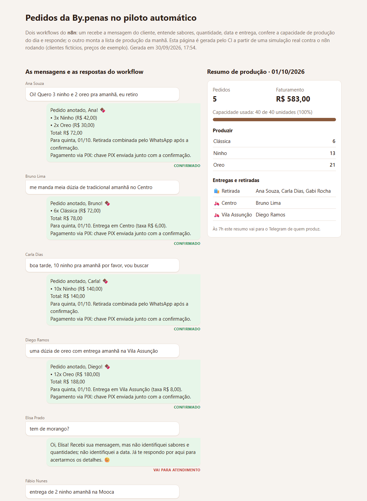
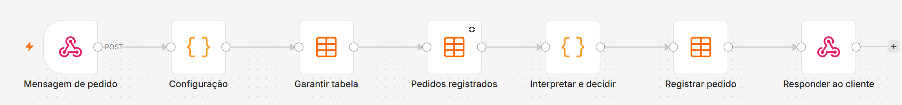
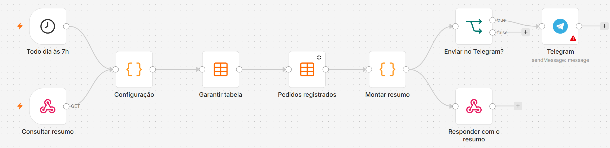
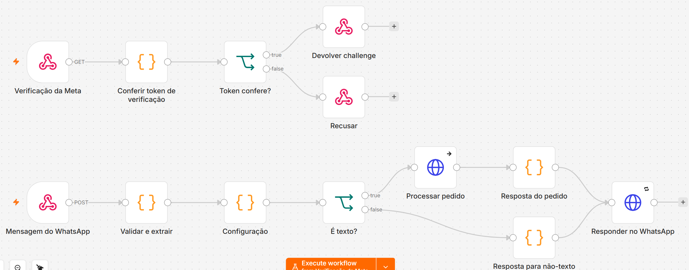

# bypenas-pedidos-n8n

[](https://github.com/arthurpenedo/bypenas-pedidos-n8n/actions/workflows/ci.yml)
[](https://github.com/arthurpenedo/bypenas-pedidos-n8n/actions/workflows/simulacao.yml)


> Automação de pedidos da **By.penas** (palha italiana gourmet) no **n8n**, ligada ao **WhatsApp**: o cliente manda "quero 3 ninho e 2 oreo pra sábado, eu retiro", o workflow entende, confere se ainda dá para produzir naquele dia, registra e responde com o total. Às 7h, quem produz recebe a lista do dia.

## O problema

Uma confeitaria pequena vende pelo WhatsApp. Cada pedido chega em texto livre e alguém precisa: entender sabores e quantidades, calcular o total e a taxa de entrega, lembrar quanto já foi prometido para aquele dia (a produção é limitada), anotar tudo e, de manhã, somar quanto fazer de cada sabor. É repetitivo, fácil de errar e tira tempo de produzir.

## Demo

**[arthurpenedo.github.io/bypenas-pedidos-n8n](https://arthurpenedo.github.io/bypenas-pedidos-n8n/)** — um dia de pedidos simulado contra o n8n rodando de verdade: cada mensagem, a resposta que o workflow devolveu e o resumo de produção. Gerado pelo CI a cada push. Clientes fictícios, preços de exemplo.

[](https://arthurpenedo.github.io/bypenas-pedidos-n8n/)

## Os workflows

**1. Receber pedido** — `POST /webhook/pedido` com `{cliente, telefone, mensagem}`



| Nó | O que faz |
|---|---|
| Configuração | Catálogo com sinônimos e preços, bairros atendidos e taxas, capacidade diária, antecedência mínima. |
| Garantir tabela | Cria a Data Table `pedidos_bypenas` na primeira execução (as seguintes reaproveitam). Sem planilha externa nem credencial. |
| Pedidos registrados | Lê os pedidos já feitos, para saber quanto do dia já está comprometido. |
| Interpretar e decidir | Entende a mensagem, calcula total e taxa, e decide: **confirmado**, **sem capacidade** (oferece o que sobra) ou **atendimento** (uma pessoa responde, com o motivo). |
| Registrar pedido | Grava tudo, inclusive o que foi para atendimento, para ninguém ficar sem resposta. |
| Responder ao cliente | Devolve a mensagem pronta para mandar no WhatsApp. |

**2. Resumo do dia** — todo dia às 7h (ou `GET /webhook/resumo?data=AAAA-MM-DD`)



Soma a produção por sabor, separa retiradas e entregas por bairro, calcula o faturamento e a capacidade usada, e manda no Telegram.

**3. WhatsApp** — webhook da WhatsApp Cloud API (Meta) em `/webhook/whatsapp`



| Nó | O que faz |
|---|---|
| Verificação da Meta (GET) | Responde o `hub.challenge` quando a Meta cadastra o webhook, só se o `hub.verify_token` bater com `WHATSAPP_VERIFY_TOKEN`; senão, 403. |
| Mensagem do WhatsApp (POST) | Responde 200 na hora (a Meta exige) e segue o processamento em segundo plano. |
| Validar e extrair | Confere a assinatura `X-Hub-Signature-256` (HMAC-SHA256 do corpo cru com o App Secret). Assinatura inválida é descartada; sem `WHATSAPP_APP_SECRET` configurado, o workflow falha em vez de aceitar qualquer coisa. Ignora avisos de status (entregue, lida). |
| É texto? | Texto vai para o workflow de pedidos; áudio, foto, figurinha etc. recebem um pedido educado para escrever em texto. |
| Processar pedido | Chama o `POST /webhook/pedido` e usa a resposta dele. Se estiver fora do ar, o cliente recebe "já te respondo" em vez de silêncio. |
| Responder no WhatsApp | Envia pela Graph API com o token guardado numa credencial Header Auth do n8n; nada de token no JSON do workflow. |

No CI, uma **Meta falsa** (`scripts/meta-falsa.js`) recebe os envios e confere o token, e `scripts/simular-whatsapp.js` testa: verificação com token certo e errado, pedido em texto com total calculado, áudio, aviso de status ignorado e **mensagem com assinatura falsa, que não pode gerar resposta**.

### O que o intérprete entende

| Mensagem | Resultado |
|---|---|
| "Quero 3 ninho e 2 oreo pra sábado, eu retiro" | 3 Ninho + 2 Oreo, próximo sábado, retirada, R$ 72,00 |
| "me manda meia dúzia de tradicional amanhã no Centro" | 6 Clássica, amanhã, entrega no Centro, R$ 72,00 + R$ 6,00 |
| "uma dúzia de oreo com entrega dia 05/10 na Vila Assunção" | 12 Oreo, 05/10, entrega, taxa do bairro |
| "tem de morango?" | atendimento: não identificou sabor; responde com o cardápio |
| "quero 5 oreo pra hoje" | atendimento: precisa de 1 dia de antecedência |
| "entrega de 2 ninho amanhã na Mooca" | atendimento: bairro fora da área |
| "quero 10 oreo amanhã" (com 33 já reservadas) | sem capacidade: "só consigo produzir mais 7" |

## Decisões técnicas

- **Regras antes de IA.** O vocabulário de um pedido é pequeno (três sabores, números, dias da semana), então um intérprete com regras resolve a maioria dos casos, custa zero e é testável. O que ele não entende vai para uma pessoa, com o motivo, em vez de virar um chute. Um LLM entraria depois, só para as mensagens que caem em atendimento.
- **Capacidade como regra de negócio.** A produção é artesanal e limitada por dia; o workflow soma o que já foi confirmado para a data e nunca promete além disso.
- **Data Tables nativas do n8n.** Nada de Google Sheets ou banco externo: a tabela é criada pelo próprio workflow, sem credencial, e fica visível na interface do n8n. Para o volume de uma confeitaria, ler a tabela inteira a cada pedido é mais simples que manter índices.
- **A lógica vive em `.js` testados.** `src/pedido.js`, `src/decisao.js` e `src/resumo.js` têm testes com `node --test`; `scripts/build.js` injeta o código nos nós Code e gera os JSON dos workflows. O CI falha se o JSON commitado não bater com as fontes.
- **Teste de ponta a ponta de verdade.** O CI instala o n8n, publica os workflows, sobe o servidor e manda um dia inteiro de mensagens pelos webhooks, conferindo cada status e o resumo final (capacidade, produção, faturamento).
- **Fuso horário explícito.** "Amanhã" e "hoje" são calculados em `America/Sao_Paulo`, independentemente do fuso do servidor.

## Como usar

1. Importe `workflows/receber-pedido.json` e `workflows/resumo-do-dia.json` no seu n8n (**Import from file**) e publique os dois.
2. No nó **Configuração**, ajuste catálogo, preços, bairros, capacidade e o texto de pagamento.
3. Para outros canais (formulário no site, outro bot), use direto o `POST /webhook/pedido` com `{ "cliente": "...", "telefone": "...", "mensagem": "..." }`; a resposta traz `status` e `resposta`.
4. Para o resumo no Telegram: crie um bot no @BotFather, cadastre a credencial no nó **Telegram**, preencha `telegram.chat_id` e mude `telegram.ativo` para `true`.

### Ligar o WhatsApp (Cloud API oficial da Meta)

1. **n8n acessível pela internet, com HTTPS** (a Meta precisa chamar o webhook): n8n Cloud, ou self-hosted num serviço como o Railway.
2. No n8n, defina as variáveis de ambiente:
   ```
   N8N_BLOCK_ENV_ACCESS_IN_NODE=false
   NODE_FUNCTION_ALLOW_BUILTIN=crypto
   WHATSAPP_APP_SECRET=<App Secret do app na Meta>
   WHATSAPP_VERIFY_TOKEN=<uma senha qualquer que você inventa>
   ```
3. Em [developers.facebook.com](https://developers.facebook.com): crie um app do tipo **Business**, adicione o produto **WhatsApp** e anote o **Phone number ID** e o **App Secret** (Configurações do app → Básico).
4. Gere um **token permanente** (usuário do sistema no Business Manager, com permissão `whatsapp_business_messaging`) e cadastre no n8n como credencial **Header Auth**: nome `Authorization`, valor `Bearer <token>`. Selecione essa credencial no nó **Responder no WhatsApp**.
5. No nó **Configuração** do workflow WhatsApp, preencha `phone_number_id` e confira `pedidos_url` (a URL do seu n8n + `/webhook/pedido`). Publique os três workflows.
6. Na Meta, em WhatsApp → Configuração → Webhook: URL `https://<seu-n8n>/webhook/whatsapp`, token de verificação = o `WHATSAPP_VERIFY_TOKEN`, e assine o campo **messages**.
7. Mande uma mensagem de teste para o número.

**Qual número usar:** o caminho mais simples é um número novo, dedicado ao bot. Usar o número que já está no app WhatsApp Business depende do recurso de coexistência da Meta (app no celular + Cloud API no mesmo número); confira a disponibilidade no momento do cadastro, porque sem ele o número sai do app. Mensagens em que o cliente fala primeiro não são cobradas pela Meta; mensagens que a empresa inicia fora da janela de 24 h exigem modelo aprovado.

Localmente, como o CI faz:

```bash
npm install -g n8n@2.41.4
for w in workflows/*.json; do n8n import:workflow --input="$w"; done
n8n publish:workflow --id=bypenasPedido001 && n8n publish:workflow --id=bypenasResumo001
n8n start &
node scripts/simular.js http://localhost:5678 simulacao.json
node scripts/pagina.js simulacao.json site/index.html
```

Desenvolvendo: `npm test` e `npm run build` (regenera os workflows depois de mudar `src/` ou `config/`).

## Limitações

- O intérprete não entende pedidos muito fora do padrão ("o de sempre", áudio, foto); esses vão para atendimento.
- Não confirma pagamento: a mensagem pede o PIX, e a conferência continua manual.
- Os preços e bairros do repositório são de exemplo.

## Próximos passos

- [x] WhatsApp Cloud API com verificação de assinatura
- [ ] LLM só para as mensagens que caem em atendimento, com saída estruturada no mesmo formato do intérprete
- [ ] Conferência de PIX pelo extrato
- [ ] Lembrete automático para o cliente na véspera da retirada

---

Feito por [Arthur Penedo](https://github.com/arthurpenedo) · [LinkedIn](https://www.linkedin.com/in/arthuralves-penedo)
